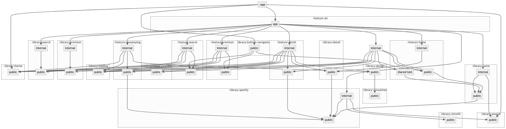

## About Songify

A "Spotify-ish" app to showcase massively scalable architecture for Android.

## Sample apps

- This scheme should keep build times hovering around 1 minute even as we scale to 1,000's of
  modules...
- Set which sample app you want to build in `:app/build.gradle`
- Now "Focus" it by running:
    - `./gradlew :app:focus --no-configure-on-demand --no-configuration-cache`
    - (Or for windows
      users) `./gradlew :app:focus --project-cache-dir=../cache --no-watch-fs --no-configuration-cache --no-configure-on-demand`
- Sync the project
- All unnecessary modules have now been unloaded and you can iterate at maximum speed!
- `:feature:detail:app` is an excellent example of the power of this architecture. `detail` is a
  leaf node to the main workflow and yet we can build it in isolation and launch directly to it.
- You can see how many modules get unloaded when we "focus" on the Premium feature:

## affectedModuleDetector

`affectedModuleDetector` is an excellent way to cut down on CI times and expenses so that an app can
scale massively.

`affectedModuleDetector` looks at the last commit of your branch to determine what modules are "
affected".

Here are 3 useful examples of running detekt, unit tests, and android tests:

`./gradlew runAffectedDetekt -Paffected_module_detector.enable --no-configure-on-demand --no-configuration-cache`
`./gradlew runAffectedUnitTests -Paffected_module_detector.enable --no-configure-on-demand --no-configuration-cache`
`./gradlew runAffectedAndroidTests -Paffected_module_detector.enable --no-configure-on-demand --no-configuration-cache`

## Architecture

### Modularization

Modularizing by feature using the "public/impl" (aka api/impl aka public/internal) scheme was first
described by Ralf Wondratschek of Square in a talk titled "Android at Scale":
https://speakerdeck.com/vrallev/android-at-scale-at-square

This allows us to unload any modules that we are not currently working on.

`:feature:*:public` - Just a `Screen` key data class.
`:feature:*:internal` - Contract/Presenter/View/ui.
`:feature:*:app` - Hilt module to "provide" a start screen or any other unsatisfied dependencies
`:library:*:public` - interfaces for UseCases and data models that we have no choice but to expose
`:library:*:internal` - implementations for UseCases
`:common:*` - Probably shouldn't exist in this architecture.
`:*:*:shared-test` - Shared stuff for `test` and `androidTest` to both depend on

Rule 1: Feature modules cannot depend on other feature modules
Exceptions:

- :feature:foo:internal -> feature:bar:public
- :feature:foo:app -> :feature:foo:internal

Rule 2: Library modules cannot depend on feature modules
Exceptions:

- :library:bottom-navigation:public -> :feature:*

Rule 3: Public library modules cannot depend on internal library modules

Rule 4: :feature:*:app modules are the only modules allowed to depend on :internal modules.

Any violations of these rules will blow up `graphAssert`.

Basically anytime we want to jump screens, we should consider making it a new feature module and any
library modules needed to support it.

### Circuit

Circuit was developed by Slack to implement the "Broadway Architecture" from CashApp.

A "Circuit" is comprised of a "Presenter" and a "View". A `:feature:foo:internal` module contributes
a `FooPresenter` and a `FooView` that are tied to a specific "Screen Key" e.g.- `FooScreen`
from `:feature:foo:public`

When the app tries to launch `FooScreen` it will check if any Presenter/View combo was contributed
for that key. If that combo wasn't included as part of this launch, then it will display a toast
that it was not found.

This allows us to fail painlessly and only load the chunks of the app that we want to navigate
across.

We test each half of the Circuit in isolation. The "Presenter" is tested in UnitTests and the "View"
is tested in instrumented tests.  (See `HomePresenterTest` and `HomeViewTest`)

## Gradle

- Convention Plugins
- Multi-module
- Sample apps with the "Focus" gradle plugin
- "Configure on Demand"
- "Configuration Cache"
- No KAPT. All KSP. KSP2 can be turned on soon. (https://github.com/google/ksp/issues/1956)
- Dependencies sorting in all modules except `:app`
- GraphAssert
- Detekt
- Lint with K2

## Libraries

- Circuit
- Compose
- Hilt/Dagger
- Moshi
- Retrofit
- K2
- Paging3
- Material3
- Accompanist
- Robolectric

## Inspirations

- Now in Android: https://github.com/android/nowinandroid
- CatchUp: https://github.com/ZacSweers/CatchUp
- TiVi: https://github.com/chrisbanes/tivi
- Circuit: https://github.com/slackhq/circuit

## TODO

- Project Isolation
- Flow tests?
- Snapshot tests?
- ModuleChecker?
- Dynamic Feature Modules?
- Refactor login flow into its own feature
- Make :public modules be Kotlin only. (No Android)
