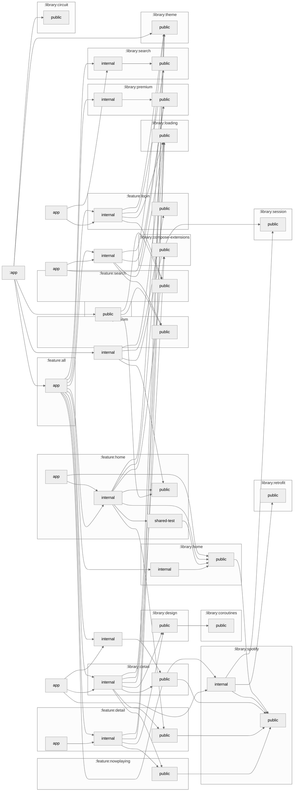
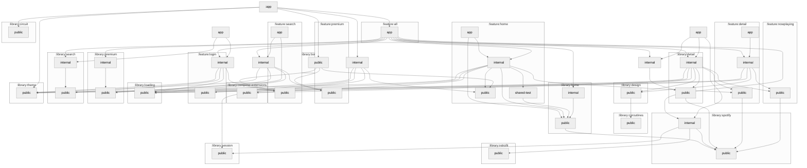

Module Graph

```mermaid
%%{
  init: {
    'theme': 'neutral'
  }
}%%

graph LR
  subgraph :feature:all
    :feature:all:app["app"]
  end
  subgraph :feature:detail
    :feature:detail:internal["internal"]
    :feature:detail:public["public"]
    :feature:detail:app["app"]
  end
  subgraph :feature:home
    :feature:home:app["app"]
    :feature:home:internal["internal"]
    :feature:home:shared-test["shared-test"]
    :feature:home:public["public"]
  end
  subgraph :feature:login
    :feature:login:internal["internal"]
    :feature:login:public["public"]
  end
  subgraph :feature:nowplaying
    :feature:nowplaying:public["public"]
    :feature:nowplaying:internal["internal"]
    :feature:nowplaying:app["app"]
  end
  subgraph :feature:premium
    :feature:premium:internal["internal"]
    :feature:premium:public["public"]
    :feature:premium:app["app"]
  end
  subgraph :feature:search
    :feature:search:internal["internal"]
    :feature:search:public["public"]
    :feature:search:app["app"]
  end
  subgraph :library:bottom-navigation
    :library:bottom-navigation:public["public"]
  end
  subgraph :library:circuit
    :library:circuit:public["public"]
  end
  subgraph :library:compose-extensions
    :library:compose-extensions:public["public"]
  end
  subgraph :library:coroutines
    :library:coroutines:public["public"]
  end
  subgraph :library:design
    :library:design:public["public"]
  end
  subgraph :library:detail
    :library:detail:public["public"]
    :library:detail:internal["internal"]
  end
  subgraph :library:home
    :library:home:public["public"]
    :library:home:internal["internal"]
  end
  subgraph :library:loading
    :library:loading:public["public"]
  end
  subgraph :library:premium
    :library:premium:internal["internal"]
    :library:premium:public["public"]
  end
  subgraph :library:retrofit
    :library:retrofit:public["public"]
  end
  subgraph :library:search
    :library:search:internal["internal"]
    :library:search:public["public"]
  end
  subgraph :library:session
    :library:session:public["public"]
  end
  subgraph :library:spotify
    :library:spotify:public["public"]
    :library:spotify:internal["internal"]
  end
  subgraph :library:theme
    :library:theme:public["public"]
  end
  :feature:detail:internal --> :feature:detail:public
  :feature:detail:internal --> :feature:nowplaying:public
  :feature:detail:internal --> :library:compose-extensions:public
  :feature:detail:internal --> :library:design:public
  :feature:detail:internal --> :library:detail:public
  :feature:detail:internal --> :library:loading:public
  :feature:detail:internal --> :library:theme:public
  :library:home:public --> :library:spotify:public
  :library:premium:internal --> :library:premium:public
  :library:spotify:internal --> :library:retrofit:public
  :library:spotify:internal --> :library:spotify:public
  :library:spotify:internal --> :library:session:public
  :feature:home:app --> :feature:home:internal
  :feature:home:app --> :library:home:public
  :feature:home:internal --> :feature:home:shared-test
  :feature:home:internal --> :feature:home:public
  :feature:home:internal --> :feature:detail:public
  :feature:home:internal --> :library:compose-extensions:public
  :feature:home:internal --> :library:home:public
  :feature:home:internal --> :library:loading:public
  :feature:home:internal --> :library:theme:public
  :app --> :feature:login:internal
  :app --> :library:bottom-navigation:public
  :app --> :library:circuit:public
  :app --> :library:theme:public
  :app --> :feature:all:app
  :library:design:public --> :library:coroutines:public
  :feature:nowplaying:internal --> :feature:nowplaying:public
  :feature:nowplaying:internal --> :library:design:public
  :feature:nowplaying:internal --> :library:loading:public
  :feature:nowplaying:internal --> :library:theme:public
  :feature:premium:internal --> :feature:premium:public
  :feature:premium:internal --> :library:loading:public
  :feature:premium:internal --> :library:premium:public
  :feature:premium:internal --> :library:theme:public
  :feature:all:app --> :feature:detail:internal
  :feature:all:app --> :feature:home:internal
  :feature:all:app --> :feature:nowplaying:internal
  :feature:all:app --> :feature:premium:internal
  :feature:all:app --> :feature:search:internal
  :feature:all:app --> :library:detail:internal
  :feature:all:app --> :library:home:internal
  :feature:all:app --> :library:premium:internal
  :feature:all:app --> :library:search:internal
  :feature:all:app --> :library:spotify:internal
  :feature:search:internal --> :feature:search:public
  :feature:search:internal --> :library:loading:public
  :feature:search:internal --> :library:search:public
  :feature:search:internal --> :library:theme:public
  :feature:login:internal --> :feature:login:public
  :feature:login:internal --> :feature:home:public
  :feature:login:internal --> :library:loading:public
  :feature:login:internal --> :library:session:public
  :library:detail:public --> :library:spotify:public
  :feature:premium:app --> :feature:premium:internal
  :feature:premium:app --> :library:premium:public
  :library:detail:internal --> :library:detail:public
  :feature:search:app --> :feature:search:internal
  :feature:search:app --> :library:search:internal
  :feature:detail:public --> :library:spotify:public
  :library:bottom-navigation:public --> :feature:home:public
  :library:bottom-navigation:public --> :feature:premium:public
  :library:bottom-navigation:public --> :feature:search:public
  :library:search:internal --> :library:search:public
  :feature:detail:app --> :feature:detail:internal
  :feature:detail:app --> :library:detail:internal
  :feature:detail:app --> :library:spotify:internal
  :feature:home:shared-test --> :library:home:public
  :feature:nowplaying:app --> :feature:nowplaying:internal
  :library:home:internal --> :library:home:public
  :feature:nowplaying:public --> :library:spotify:public
```

### Module Graph

```mermaid
%%{
  init: {
    'theme': 'neutral'
  }
}%%

graph
  subgraph :feature:all
    :feature:all:app["app"]
  end
  subgraph :feature:detail
    :feature:detail:internal["internal"]
    :feature:detail:public["public"]
    :feature:detail:app["app"]
  end
  subgraph :feature:home
    :feature:home:app["app"]
    :feature:home:internal["internal"]
    :feature:home:shared-test["shared-test"]
    :feature:home:public["public"]
  end
  subgraph :feature:login
    :feature:login:internal["internal"]
    :feature:login:public["public"]
  end
  subgraph :feature:nowplaying
    :feature:nowplaying:public["public"]
    :feature:nowplaying:internal["internal"]
    :feature:nowplaying:app["app"]
  end
  subgraph :feature:premium
    :feature:premium:internal["internal"]
    :feature:premium:public["public"]
    :feature:premium:app["app"]
  end
  subgraph :feature:search
    :feature:search:internal["internal"]
    :feature:search:public["public"]
    :feature:search:app["app"]
  end
  subgraph :library:bottom-navigation
    :library:bottom-navigation:public["public"]
  end
  subgraph :library:circuit
    :library:circuit:public["public"]
  end
  subgraph :library:compose-extensions
    :library:compose-extensions:public["public"]
  end
  subgraph :library:coroutines
    :library:coroutines:public["public"]
  end
  subgraph :library:design
    :library:design:public["public"]
  end
  subgraph :library:detail
    :library:detail:public["public"]
    :library:detail:internal["internal"]
  end
  subgraph :library:home
    :library:home:public["public"]
    :library:home:internal["internal"]
  end
  subgraph :library:loading
    :library:loading:public["public"]
  end
  subgraph :library:premium
    :library:premium:internal["internal"]
    :library:premium:public["public"]
  end
  subgraph :library:retrofit
    :library:retrofit:public["public"]
  end
  subgraph :library:search
    :library:search:internal["internal"]
    :library:search:public["public"]
  end
  subgraph :library:session
    :library:session:public["public"]
  end
  subgraph :library:spotify
    :library:spotify:public["public"]
    :library:spotify:internal["internal"]
  end
  subgraph :library:theme
    :library:theme:public["public"]
  end
  :feature:detail:internal --> :feature:detail:public
  :feature:detail:internal --> :feature:nowplaying:public
  :feature:detail:internal --> :library:compose-extensions:public
  :feature:detail:internal --> :library:design:public
  :feature:detail:internal --> :library:detail:public
  :feature:detail:internal --> :library:loading:public
  :feature:detail:internal --> :library:theme:public
  :library:home:public --> :library:spotify:public
  :library:premium:internal --> :library:premium:public
  :library:spotify:internal --> :library:retrofit:public
  :library:spotify:internal --> :library:spotify:public
  :library:spotify:internal --> :library:session:public
  :feature:home:app --> :feature:home:internal
  :feature:home:app --> :library:home:public
  :feature:home:internal --> :feature:home:shared-test
  :feature:home:internal --> :feature:home:public
  :feature:home:internal --> :feature:detail:public
  :feature:home:internal --> :library:compose-extensions:public
  :feature:home:internal --> :library:home:public
  :feature:home:internal --> :library:loading:public
  :feature:home:internal --> :library:theme:public
  :app --> :feature:login:internal
  :app --> :library:bottom-navigation:public
  :app --> :library:circuit:public
  :app --> :library:theme:public
  :app --> :feature:all:app
  :library:design:public --> :library:coroutines:public
  :feature:nowplaying:internal --> :feature:nowplaying:public
  :feature:nowplaying:internal --> :library:design:public
  :feature:nowplaying:internal --> :library:loading:public
  :feature:nowplaying:internal --> :library:theme:public
  :feature:premium:internal --> :feature:premium:public
  :feature:premium:internal --> :library:loading:public
  :feature:premium:internal --> :library:premium:public
  :feature:premium:internal --> :library:theme:public
  :feature:all:app --> :feature:detail:internal
  :feature:all:app --> :feature:home:internal
  :feature:all:app --> :feature:nowplaying:internal
  :feature:all:app --> :feature:premium:internal
  :feature:all:app --> :feature:search:internal
  :feature:all:app --> :library:detail:internal
  :feature:all:app --> :library:home:internal
  :feature:all:app --> :library:premium:internal
  :feature:all:app --> :library:search:internal
  :feature:all:app --> :library:spotify:internal
  :feature:search:internal --> :feature:search:public
  :feature:search:internal --> :library:loading:public
  :feature:search:internal --> :library:search:public
  :feature:search:internal --> :library:theme:public
  :feature:login:internal --> :feature:login:public
  :feature:login:internal --> :feature:home:public
  :feature:login:internal --> :library:loading:public
  :feature:login:internal --> :library:session:public
  :library:detail:public --> :library:spotify:public
  :feature:premium:app --> :feature:premium:internal
  :feature:premium:app --> :library:premium:public
  :library:detail:internal --> :library:detail:public
  :feature:search:app --> :feature:search:internal
  :feature:search:app --> :library:search:internal
  :feature:detail:public --> :library:spotify:public
  :library:bottom-navigation:public --> :feature:home:public
  :library:bottom-navigation:public --> :feature:premium:public
  :library:bottom-navigation:public --> :feature:search:public
  :library:search:internal --> :library:search:public
  :feature:detail:app --> :feature:detail:internal
  :feature:detail:app --> :library:detail:internal
  :feature:detail:app --> :library:spotify:internal
  :feature:home:shared-test --> :library:home:public
  :feature:nowplaying:app --> :feature:nowplaying:internal
  :library:home:internal --> :library:home:public
  :feature:nowplaying:public --> :library:spotify:public
```
